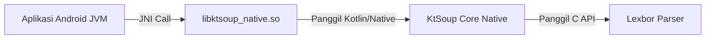

# Panduan Penggunaan Kotlin/Native (`androidNativeArm64`) sebagai Shared Library (`.so`) di Aplikasi Android

Panduan ini menjelaskan cara membungkus kode Kotlin/Native KtSoup (yang berjalan di atas parser native **Lexbor**) ke dalam bentuk Shared Library JNI (`.so` file) sehingga dapat dipanggil secara langsung oleh aplikasi Android Studio berbasis JVM (Java/Kotlin) menggunakan Java Native Interface (JNI).

---

## Alur Kerja Integrasi



---

## Langkah 1: Buat JNI Bridge di Kotlin/Native

Untuk mengekspos fungsi Kotlin/Native ke runtime JVM Android, kita harus menulis fungsi JNI menggunakan penamaan khas C JNI dan anotasi `@CName`.

Buat file baru di source set `nativeMain` proyek Kotlin/Native Anda (misal `src/nativeMain/kotlin/NativeBridge.kt`):

```kotlin
import kotlinx.cinterop.*
import ktsoup.KtSoupParser

// Struktur JNI standard Java
// Nama fungsi harus mengikuti format: Java_<package_name>_<class_name>_<function_name>
@CName("Java_com_example_myapp_NativeParser_parseHtml")
fun parseHtml(
    env: COpaquePointer,
    clazz: COpaquePointer,
    html: COpaquePointer
): COpaquePointer? {
    // 1. Cast JNIEnv dan jstring ke tipe pointer C
    val jniEnv = env.reinterpret<platform.android.JNIEnvVar>().pointed.pointed!!
    val jhtml = html.reinterpret<platform.android._jobject>()

    // 2. Konversi Java string ke Kotlin String
    val htmlChars = jniEnv.GetStringUTFChars!!(env.reinterpret(), jhtml, null)
    val htmlKotlin = htmlChars?.toKString() ?: ""
    jniEnv.ReleaseStringUTFChars!!(env.reinterpret(), jhtml, htmlChars)

    // 3. Jalankan Parsing menggunakan KtSoup (Lexbor Native)
    val document = KtSoupParser.parse(htmlKotlin)
    val resultText = document.use { doc ->
        doc.querySelector("body")?.textContent() ?: ""
    }

    // 4. Konversi Kotlin String kembali ke Java String (jstring) untuk dikembalikan
    return jniEnv.NewStringUTF!!(env.reinterpret(), resultText.utf8.ptr).reinterpret()
}
```

---

## Langkah 2: Konfigurasi build.gradle.kts untuk Menghasilkan `.so`

Buka file `build.gradle.kts` modul Kotlin/Native Anda, lalu konfigurasi target `androidNativeArm64` untuk memproduksi **Shared Library (`sharedLib`)**:

```kotlin
kotlin {
    androidNativeArm64 {
        binaries {
            sharedLib {
                baseName = "ktsoup_native" // Menghasilkan libktsoup_native.so
            }
        }
    }
}
```

Setelah itu, jalankan perintah kompilasi:
```bash
./gradlew :linkReleaseSharedLibraryAndroidNativeArm64
```
Setelah kompilasi selesai, file `.so` yang dioptimalkan akan terletak di:
`build/bin/androidNativeArm64/releaseShared/libktsoup_native.so`

---

## Langkah 3: Pasang `.so` ke Proyek Android Studio Anda

1. Buka proyek aplikasi Android Studio (Java/Kotlin JVM) Anda.
2. Buat folder baru bernama **`jniLibs`** di dalam folder `src/main/` modul aplikasi Anda:
   `app/src/main/jniLibs/arm64-v8a/`
3. Salin file `libktsoup_native.so` hasil build tadi ke dalam folder `arm64-v8a/` tersebut.

Struktur folder proyek Android Anda akan terlihat seperti ini:
```text
app/
├── src/
│   └── main/
│       ├── java/com/example/myapp/
│       └── jniLibs/
│           └── arm64-v8a/
│               └── libktsoup_native.so
└── build.gradle
```

---

## Langkah 4: Muat dan Panggil Library di Aplikasi Android

Buat class deklarasi native di aplikasi Android Studio Anda sesuai dengan nama package yang Anda daftarkan di Langkah 1:

```kotlin
package com.example.myapp

class NativeParser {
    companion object {
        init {
            // Memuat file libktsoup_native.so dari jniLibs
            System.loadLibrary("ktsoup_native")
        }
    }

    // Deklarasi fungsi native yang diimplementasikan di Kotlin/Native
    external fun parseHtml(html: String): String
}
```

### Cara Pemanggilan di Activity:
```kotlin
val html = "<html><body><h1>Konten Native Lexbor</h1></body></html>"

val parser = NativeParser()
val hasil = parser.parseHtml(html)

println(hasil) // Output: Konten Native Lexbor
```
Dengan cara ini, aplikasi Android biasa Anda dapat memanggil parser HTML berbasis **Lexbor** secara native dengan performa penuh!
